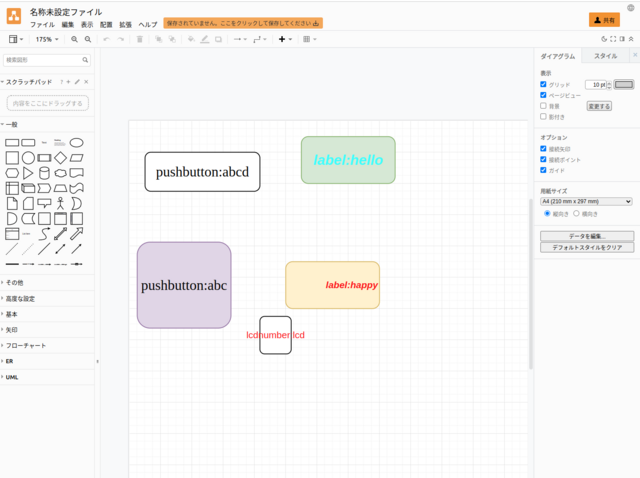
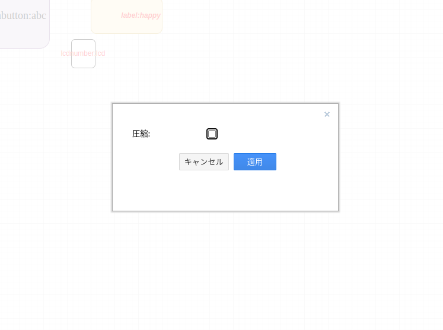

# PyamlSide2（ぴゃむるさいどつー）

[](https://badge.fury.io/py/PyamlSide2)

- [Zenn「最もシンプルなGUI設計パッケージPyamlQtについて」](https://zenn.dev/array/articles/9617ae0bbd8a80)

PySide2 configuration in yaml format providing the most simple script.

## Requirements

- yaml
- PySide2

## Installation

```bash
cd <path-to-ReadableWidgets>/PyamlSide2
pip install .
```

## Demo

```bash
python3 examples/chaos.py
```

<br>

## Tutorial

### 1. create drawio-xml

Open [draw.io](https://app.diagrams.net/).

---

Put the `Rounded Rectangle` and add text.

<br>

+----------------------+

| widget:unique-label  |

+----------------------+

<br>

- widget : widget name `pushbutton, label, ...`
- unique-label : Unique label (also treated as a Key in Python).




> Don't use compression flag. (Please uncheck.)




### 2. Generate YAML file from drawio-xml

> Although it is possible to convert directly from drawio-xml, conversion to YAML is recommended for readability.

```bash
rw_xml2yaml -i <input .xml> -o <output .yaml>
```

### 3. Generate Python file from YAML

Create a sample Python program from a YAML file.

```bash
rw_gen_py -i <input .yaml> -o <output .py>
```

### 4. Run example python template

```bash
python3 <output .py (3rd step)> <input .yaml (3rd step)>
```

<br>

## Template

<details>
<summary>Previously (v0.3.2)</summary>

See `examples/simple_gui.py`.

```python
import sys
import os

from pyamlside2.mainwindow import PyamlSide2Window
from PySide2.QtWidgets import QApplication

class MainWindow(pyamlside2Window):
    def __init__(self):
        self.number = 0
        yaml_path = os.path.join(os.path.dirname(__file__), "../yaml/chaos.yaml")
        super().__init__(yaml_path)
        # your code -------------------------
        # ************ #
        # -----------------------------------
        self.show()

if __name__ == '__main__':
    app = QApplication(sys.argv)
    window = MainWindow()
    sys.exit(app.exec_())
```

<!-- Run `python3 <path-to-script>/simple_gui.py`. -->


## Test YAML 📝

`pyamlside2_yaml` is preview feature app.

```bash
pyamlside2_yaml <yaml-file-path or draw.io xml-file>
# pyamlside2_yaml PySide2/drawio_xml/example.xml
```

## Elements (dev)
In yaml, you can add the following elements defined in PyQt.Widgets This may be added in the future.

- pushbutton : definition of QPushButton
- qlabel : definition of QLabel 
- qlcdnumber : definition of QLCDNumber
- qprogressbar : definition of QProgressBar
- qlineedit : definition of QLineEdit
- qcheckbox : definition of QCheckbox
- qslider : definition of QSlider
- qspinbox : definition of QSpinBox
- qcombobox : definition of QCombobox
- image : definition of QLabel (using image path)
- stylesheet : definition of Stylesheet (define as QLabel and `setHidden=True`)

### YAML format

PyamlQt defines common elements for simplicity. Not all values need to be defined, but if not set, default values will be applied

```yaml
WINDOW: # unique key (Define key)
  type: window
  x: 0
  y: 0
  width: 800
  height: 720
  title: "example"

slider2: # keyname
  type: qslider # QWidgets
  x_center: 500 # x center point
  y_center: 550 # y center point
  rect:
    width: 200 # QWidgets width
    height: 50 # QWidgets height
  max: 100 # QObject max value
  min: 0 # QObject min value
  default: 70 # QObject set default value
  text: "Slider" # Set Text
  style: # Setting style using stylesheet (css)
    font: 30px # font size
    color: #ff0000 # Color
    font-family: Ubuntu # font-family
  items: # Selectable items( Combobox's option )
    - a
    - b
    - c
```
</details>
