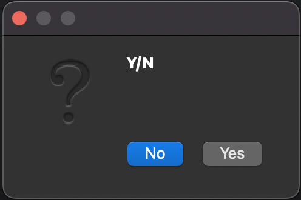
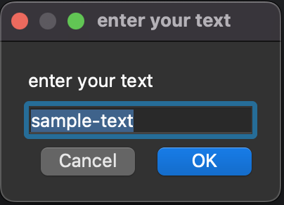
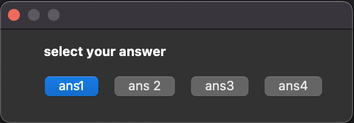
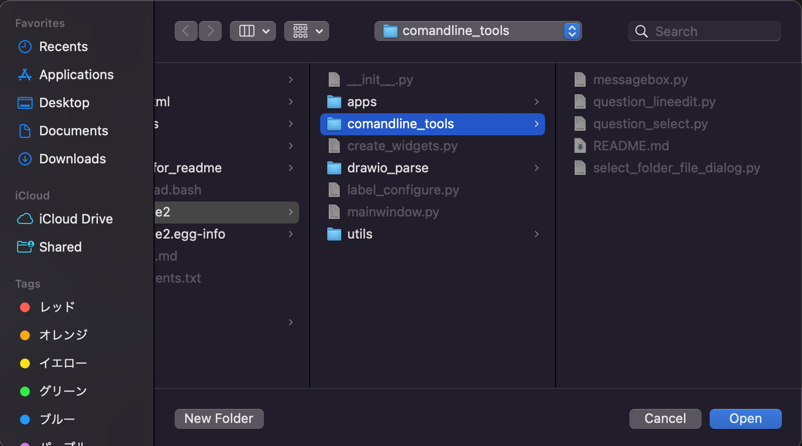

# commandline-tools

The best technique for GUIing variables in shell scripts is to use command_line_tools.
You can receive a string as a return value by installing it with pypi or invoking the corresponding script with a relative path.

<br>

## messagebox.py



- `--title`: Question for lineedit.
- `--type`: icon type (Default: `information`)
  - `information`: Set widget as information.
  - `warning`: Set widget as warning.
  - `critical`: Set widget as critical.
  - `question`: Set widget as question. (return "Yes" or "No" as string)


```bash
ANS=`python messagebox.py --title Y/N --type question`
echo $ANS
```

<br>

## question_lineedit.py



- `--title`: Question for lineedit.
- `--default`: Default input text. (Default: None)

```bash
ANS=`python question_lineedit.py --title "enter your text" --default sample-text`
echo $ANS
```

<br>

## question_select.py



- `--title`: Question for buttons.
- `--answer-list`: Buttons input (split by space)

```bash
ANS=`python question_select.py --title "select your answer" --answer-list ans1 "ans 2" ans3 ans4`
echo $ANS
```

<br>

## select_folder_file_dialog.py

- `--title`: Question for buttons.
- `--path`: Entry point for search.
- `--file`: Using file mode. (If not used, only folder can be select.)
  - `--ext`:  (split by space)

### select file mode (filter using extension)


```bash
ANS=`python select_folder_file_dialog.py --title "select your file" --file --path ./ --ext "*.md"`
echo $ANS
```

### select folder mode



```bash
ANS=`python select_folder_file_dialog.py --title "select your file" --path ./`
echo $AWS
```
